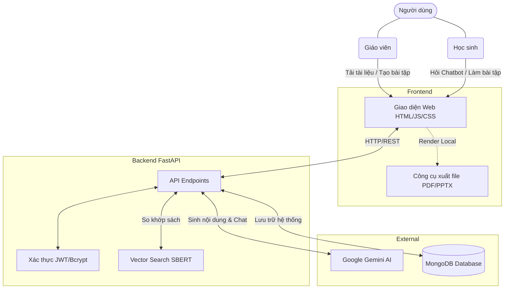

<div align="center">

# BookBridge

<br>
<em>
BookBridge là một nền tảng học liệu mở và thông minh, giúp kết nối giáo viên và học sinh thông qua hệ thống tài nguyên học tập, chia sẻ sách, và công cụ tạo bài giảng/bài tập tự động nhờ sức mạnh của AI.
</em>
</br>

[](https://img.shields.io/badge/logo-HTML5-e34f26?logo=html5&label=&labelColor=555555&logoColor=white)
[](https://img.shields.io/badge/CSS-639?logo=css&logoColor=fff)
[](https://img.shields.io/badge/JavaScript-F7DF1E?&logo=javascript&logoColor=black)

[](https://shields.io/badge/python-3.11+-blue)
[](https://img.shields.io/badge/FastAPI-009688?style=flat&logo=FastAPI&labelColor=555&logoColor=white)
[](https://img.shields.io/badge/-Pandas-333333?style=flat&logo=pandas)
[](https://img.shields.io/badge/Gemini-Flash-8E75B2?logo=googlegemini&logoColor=white)
[](https://img.shields.io/badge/-MongoDB-13aa52?style=flat-square&logo=mongodb&logoColor=white)

</div>

## 🪙 Live demo ở đây: [Bookbridge](https://bookbridge-liart.vercel.app/exercise.html)

## ⚡️ Tổng quan (Overview)

Khi cả nước chuyển sang dùng một bộ sách giáo khoa thống nhất, nguồn cung ở một số địa phương và trường học có thể chưa theo kịp nhu cầu. Học sinh thiếu tài liệu trong những tuần đầu năm học, còn phụ huynh phải tìm cách xoay xở, trong đó có cách sao chụp sách, một việc có thể vi phạm quyền tác giả.

Trong khi đó, nhiều gia đình đang có sẵn sách của các bộ khác (Chân trời sáng tạo, Cánh diều). Theo Bộ GD&ĐT, các bộ này được chuyển sang vai trò **tài liệu tham khảo, học liệu bổ trợ** để giáo viên và học sinh tham khảo, so sánh, đối chiếu.

**SGK Cầu Nối** biến nguồn sách sẵn có đó thành giải pháp hợp pháp, gần như không tốn chi phí:

1. **Nhận diện** cuốn sách học sinh đang có (chụp bìa/mục lục hoặc chọn tay).
2. **Đối chiếu** với bộ sách thống nhất bằng _bảng tương ứng bài học_: "Bài này của sách thống nhất ứng với chương nào, trang nào trong sách của bạn", kèm **mức phủ nội dung**.
3. **Kết nối** các bạn thừa sách và thiếu sách trong cùng trường, cùng lớp, cùng phường để cho mượn.
4. **Hỗ trợ tự học** bằng bài tập gốc theo từng bài, cùng đường dẫn tới SGK điện tử chính thức.

## 🎯 Tính năng chính

| Tính năng                     | Mô tả                                                                                          |
| ----------------------------- | ---------------------------------------------------------------------------------------------- |
| 🔍 **Nhận diện sách**         | Chụp bìa hoặc mục lục. Ảnh được nhận diện chữ ngay trên điện thoại, không gửi đi và không lưu. |
| 🔗 **Bảng tương ứng bài học** | Chỉ ra bài nào của sách thống nhất nằm ở đâu trong sách bạn đang có.                           |
| 🤝 **Ghép sách cho mượn**     | Ghép theo trường, lớp, phường/xã. Không dùng GPS. Trao đổi tại trường.                         |
| ✏️ **Hướng dẫn tự học**       | Bài tập gốc theo yêu cầu cần đạt của Chương trình 2018.                                        |
| 💬 **Trợ lý hỏi đáp**         | Hỏi bằng lời, trả lời dựa trên dữ liệu đã kiểm chứng của hệ thống.                             |

Phần lớn kết luận (sách thuộc bộ nào, mức phủ, thứ tự ghép) do **quy tắc và phép tính** quyết định. AI chỉ hỗ trợ ở những chỗ có giá trị rõ ràng: gợi ý bảng tương ứng (có người duyệt), tạo bài tập gốc, và giao tiếp bằng lời. Cách này giữ kết quả kiểm tra được và giữ chi phí gần như bằng không.

## 🧷 Nguyên tắc thiết kế

- **Tôn trọng bản quyền.** Hệ thống không lưu, không sao chép và không phát lại nội dung sách giáo khoa. Chỉ lưu thông tin mô tả (tên sách, tên bài, số trang) và dẫn tới nguồn chính thức.
- **Bảo vệ trẻ em và quyền riêng tư.** Không dùng GPS, không thu địa chỉ nhà hay số điện thoại, hiển thị ẩn danh, trao đổi sách tại trường qua giáo viên chủ nhiệm.
- **Trung thực về độ chắc chắn.** Dùng "mức phủ nội dung" thay vì "độ chính xác". Khi không đủ dữ liệu, hệ thống nói "chưa xác định được" thay vì đoán.
- **Chỉ là cầu nối.** Sách bộ khác được gọi đúng là tài liệu tham khảo. Hệ thống không thay thế sách giáo khoa chính thức và tự thu hẹp vai trò khi sách về đủ.
- **Chi phí thấp.** Ưu tiên tra cứu, bộ nhớ đệm và bài tập sinh sẵn để không phụ thuộc vào số token.

## 👁️ Tầm nhìn

**Không học sinh nào phải chờ sách để bắt đầu học.**

Chúng tôi tin rằng một sự thay đổi chính sách, dù đúng hướng, cũng không nên để lại khoảng trống cho các em trong giai đoạn chuyển đổi. Và những cuốn sách đã nằm trên kệ của hàng nghìn gia đình đáng được dùng tiếp, thay vì bị bỏ đi.

Dài hạn, chúng tôi hướng tới:

- **Một "thư viện chia sẻ" của cộng đồng trường học**, nơi sách được luân chuyển giữa các lớp và các năm, giảm lãng phí và giảm chi phí cho phụ huynh.
- **Bảng tương ứng bài học được giáo viên cùng xây dựng và kiểm chứng**, phủ nhiều môn, nhiều lớp.
- **Trợ lý học tập tiếng Việt** hỗ trợ các em tự học một cách trung thực, minh bạch về nguồn và giới hạn.
- **Một mô hình mà các trường có thể tự triển khai**, kể cả nơi có kết nối Internet hạn chế, trong phạm vi được phép của nhà xuất bản và cơ quan quản lý.

## 📓 Phạm vi hiện tại và giới hạn

- Bản hiện tại là **bản demo**, tập trung vào **một môn, một lớp** và một số bộ sách để chứng minh giải pháp.
- **Bảng tương ứng do nhóm đối chiếu, chưa được nhà xuất bản hay Bộ GD&ĐT xác nhận**, nên có thể sót hoặc lệch. Mức phủ cao không có nghĩa nội dung và độ sâu giống hệt nhau.
- Bài tập do AI tạo, nên được giáo viên kiểm tra trước khi dùng.
- Dự án **không phải tư vấn pháp lý**. Các nội dung liên quan đến bản quyền cần được đối chiếu với quy định hiện hành.

## 🗂️ Ghi nhận nguồn

Thông tin về bộ sách thống nhất, vai trò của các bộ sách khác và danh mục sách chỉnh sửa dựa trên thông báo của Bộ GD&ĐT và Nhà xuất bản Giáo dục Việt Nam. Vui lòng đối chiếu nguồn chính thức:

- Học Liệu Số (SGK điện tử)
- https://taphuan.nxbgd.vn

## 🚀 Tính năng nổi bật

- **Trợ lý Ảo Sylvi AI**: Trợ lý học tập AI chuyên biệt, hỗ trợ giải đáp thắc mắc và đề xuất nguồn tài liệu/sách giáo khoa một cách nhanh chóng.
- **Studio AI & Quản lý (Dành cho Giáo viên)**:
  - Tải lên tài liệu dạng văn bản (PDF, DOCX, TXT) và AI sẽ tự động phân tích.
  - Tự động sinh ra **Tóm tắt lý thuyết trọng tâm** (chuẩn 1 trang A4).
  - Tự động sinh ra **Bộ câu hỏi trắc nghiệm** theo thang nhận thức Bloom để làm bài trực tuyến.
  - Tự động sinh ra **Dàn ý Slide thuyết trình** (có thể xuất ra file PowerPoint).
- **Không gian học tập (Dành cho Học sinh)**: Truy cập kho bài tập, ôn luyện và nhận kết quả tức thì.
- **Ghép đôi (Pairing)**: Hệ thống cho phép học sinh tìm kiếm, mượn và chia sẻ sách giáo khoa với những người dùng khác.

---

## 🏗 Kiến trúc & Luồng hoạt động (Workflow)



---

## 🛠 Tech Stack

**Frontend:**

- **Core**: HTML5, Vanilla JavaScript, CSS3
- **Styling**: Tailwind CSS (sử dụng qua CDN)
- **Utilities**:
  - [KaTeX](https://katex.org/) để hiển thị công thức Toán học/Vật lý/Hóa học trực quan.
  - Các thư viện hỗ trợ xuất file: `html2pdf.js` và `PptxGenJS`.

**Backend:**

- **Core**: Python 3, FastAPI, Uvicorn
- **AI & NLP**:
  - Google GenAI SDK (Sử dụng model `gemini-2.5-flash`) để khởi tạo nội dung và làm trợ lý ảo.
  - `sentence-transformers` (`keepitreal/vietnamese-sbert`) kết hợp `torch` để so khớp từ vựng, tính toán độ tương đồng nội dung.
- **Data Processing**: Pandas (xử lý dữ liệu đầu vào từ CSV).
- **Auth**: PyJWT, bcrypt để mã hóa và xác thực người dùng an toàn.

**Database:**

- **MongoDB** (kết nối thông qua `pymongo` / `certifi`)

---

## ⚙️ Hướng dẫn Cài đặt & Chạy Offline (Local Development)

Để triển khai dự án này trên máy cá nhân, vui lòng làm theo các bước sau:

### Yêu cầu hệ thống

- **Python 3.9+** trở lên.
- **MongoDB** (Bạn có thể cài đặt MongoDB Community Server chạy local, hoặc dùng MongoDB Atlas).
- **API Key** của Google Gemini (Lấy tại [Google AI Studio](https://aistudio.google.com/)).

### Bước 1: Clone kho lưu trữ

```bash
git clone <url-repo-github-cua-ban>
cd BookBridge
```

### Bước 2: Cài đặt thư viện Backend

Nên sử dụng môi trường ảo (virtual environment) để cài đặt các package:

```bash
# Tạo môi trường ảo
python -m venv venv

# Kích hoạt môi trường ảo
# Trên Mac/Linux:
source venv/bin/activate
# Trên Windows:
venv\Scripts\activate

# Cài đặt các thư viện cần thiết
pip install fastapi uvicorn pandas sentence-transformers torch python-dotenv google-genai certifi pymongo bcrypt pyjwt
```

### Bước 3: Cấu hình biến môi trường

Tạo một file `.env.local` ở thư mục gốc của dự án (cùng cấp với file `api.py`) và điền các thông tin sau:

```env
# API Key của Gemini
LLM_API_KEY=your_gemini_api_key_here
LLM_MODEL=gemini-2.5-flash

# Kết nối CSDL MongoDB (Thay đổi nếu bạn dùng Atlas)
MONGODB_URL=mongodb://localhost:27017/bookbridge

# Secret key để tạo token JWT
JWT_SECRET=supersecretkey_change_in_production
```

### Bước 4: Chạy Server Backend

Mở terminal và chạy lệnh:

```bash
uvicorn api:app --reload
```

Server backend sẽ chạy tại `http://127.0.0.1:8000`. (Bạn có thể xem Swagger UI API docs tại `http://127.0.0.1:8000/docs`).

### Bước 5: Chạy Frontend

Do Frontend hoàn toàn dùng HTML/CSS/JS thuần, bạn có thể chạy bằng cách dùng Live Server extension trong VSCode (hoặc mở trực tiếp file HTML, tuy nhiên khuyến nghị dùng một server HTTP).

Sử dụng HTTP server của Python từ thư mục gốc dự án:

```bash
python -m http.server 5500
```

Sau đó truy cập trình duyệt tại địa chỉ: `http://localhost:5500/src/home_page.html`

---

## 📁 Cấu trúc thư mục chính

```text
BookBridge/
├── api.py               # Toàn bộ logic backend (FastAPI routing, Auth, AI processing, Vector search)
├── Data/                # Chứa các file CSV (filter_content.csv, book_link.csv)
├── src/                 # Thư mục giao diện Frontend
│   ├── css/             # Custom CSS
│   ├── js/              # Chứa các file logic frontend (chat.js, tailwind-config.js,...)
│   ├── img/             # Hình ảnh, icon của dự án
│   └── *.html           # Các trang giao diện (home_page, exercise, pairing, login,...)
├── scratch/             # Các script testing / crawl dữ liệu tạm thời
└── readme.md            # Tài liệu dự án
```
